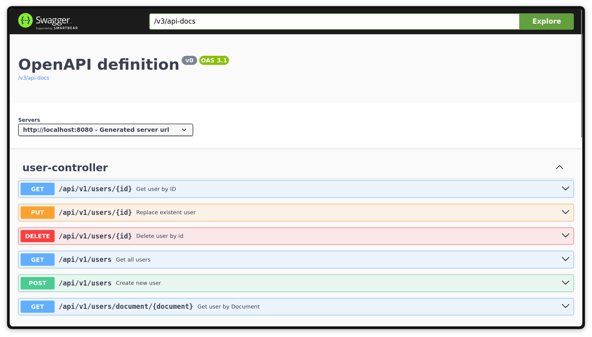
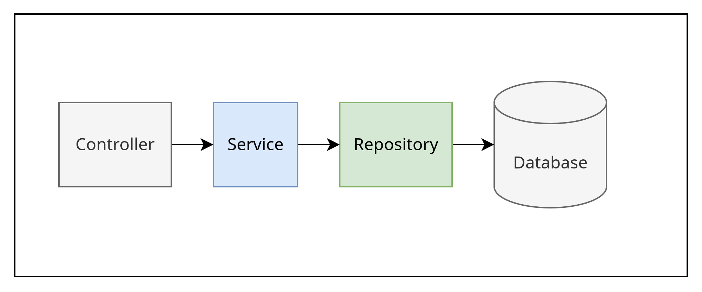
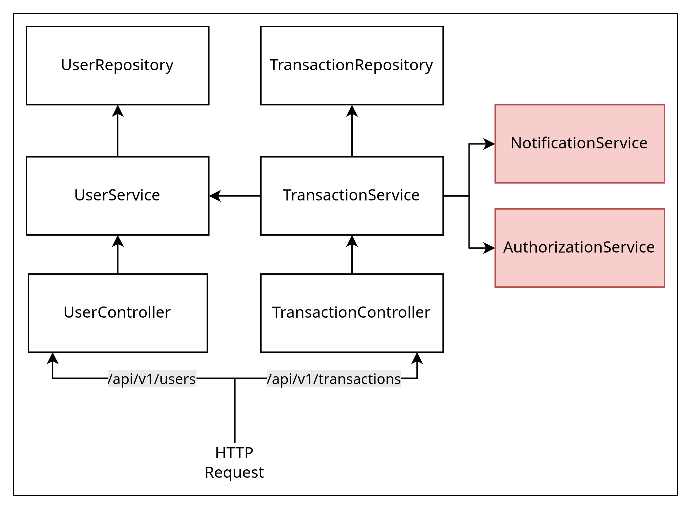
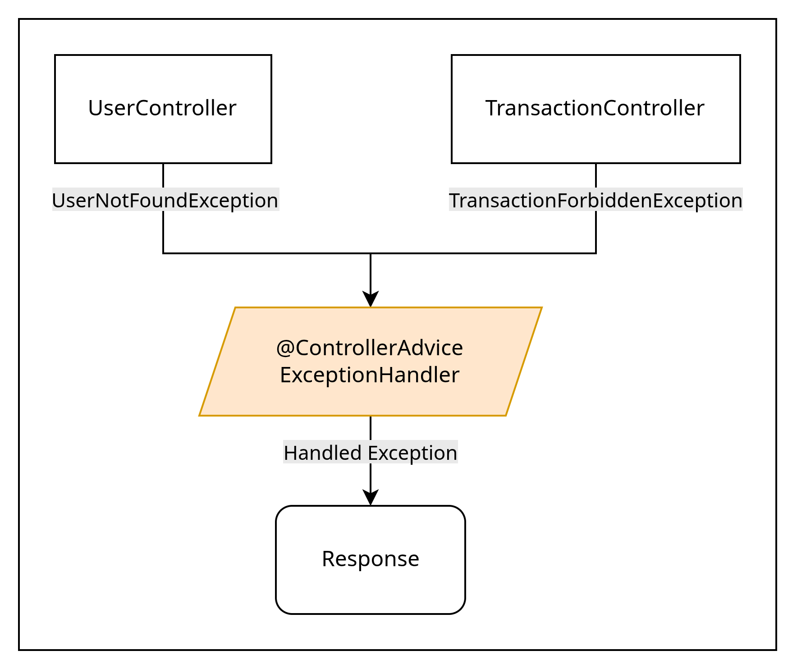
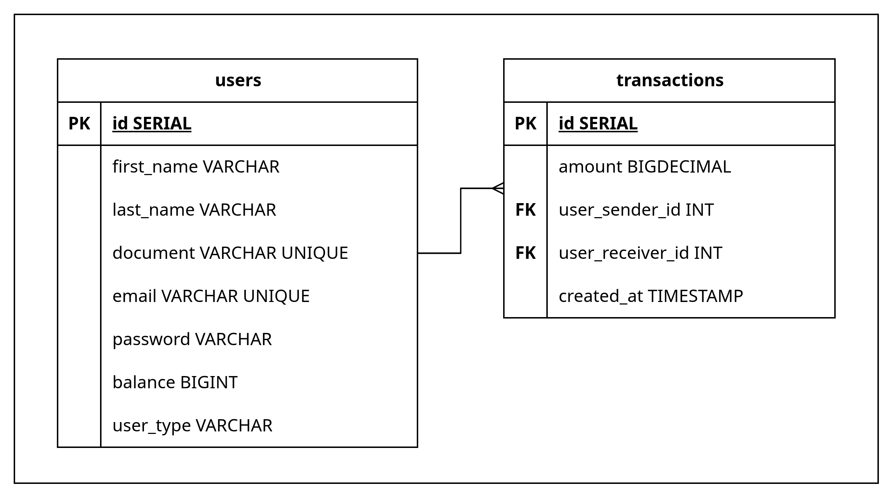

# ✅ Desafio Backend - PicPay ✅

Essa aplicação foi desenvolvida como resolução ao desafio BackEnd do PicPay.
A proposta é uma API RESTful para processar transações, além do cadastro de usuários.

Repositório do desafio: https://github.com/PicPay/picpay-desafio-backend

## 📃 Requisitos do desafio
A seguir estão algumas regras de negócio que são importantes para o funcionamento do PicPay Simplificado:

- Temos 2 tipos de usuários, os comuns e lojistas, ambos têm carteira com dinheiro e realizam transferências entre eles.

- Para ambos tipos de usuário, precisamos do Nome Completo, CPF, e-mail e Senha. CPF/CNPJ e e-mails devem ser únicos no sistema. Sendo assim, seu sistema deve permitir apenas um cadastro com o mesmo CPF ou endereço de e-mail;

- Usuários podem enviar dinheiro (efetuar transferência) para lojistas e entre usuários;

- Lojistas só recebem transferências, não enviam dinheiro para ninguém;

- Validar se o usuário tem saldo antes da transferência;

- Antes de finalizar a transferência, deve-se consultar um serviço autorizador externo, use este mock https://util.devi.tools/api/v2/authorize para simular o serviço utilizando o verbo GET;

- A operação de transferência deve ser uma transação (ou seja, revertida em qualquer caso de inconsistência) e o dinheiro deve voltar para a carteira do usuário que envia;

- No recebimento de pagamento, o usuário ou lojista precisa receber notificação (envio de email, sms) enviada por um serviço de terceiro e eventualmente este serviço pode estar indisponível/instável. Use este mock https://util.devi.tools/api/v1/notify)) para simular o envio da notificação utilizando o verbo POST;

- Este serviço deve ser RESTFul.


---


## 📌 Tecnologias utilizadas

- Java 17
- Spring Framework
- Spring Boot
- Hibernate ORM
- H2 Database
- PostgreSQL
- Apache Maven
- Lombok
- Javadoc
- Spring openAPI (Swagger)


---


## 🗃️ Documentação

### Projeto

Para ler a documentação do projeto, utilize o javadoc.

1. Execute: `mvn javadoc:javadoc`
2. Abra: `target/site/apidoc/index.html`


### API

Para ler a documentação da API, utilize o swagger.

1. Inicie a aplicação: `mvn spring-boot:run`
2. Acesse: `/swagger-ui/index.html`

Você deve ver:




---


## 🌐 Como executar
    
### Requisitos

- Java 17
- Apache Maven


### Sem persistência de dados (H2 Database) 

1. Configurar `application.yaml`:

```yaml
spring:
    profiles:
        active: dev
```

2. Iniciar aplicação: `mvn spring-boot:run`


### Com Persistência de dados (PostgreSQL)

1. Configurar `application.yaml`

```yaml
spring:
    profiles:
        active: prod
```

2. Exportar variáveis de ambiente

```env
DB_HOST=[SEU HOST]
DB_PORT=5432
DB_DATABASE=[SEU DATABASE]
DB_USER=[SEU USUARIO]
DB_PASSWORD=[SUA SENHA]    
URL_API_AUTH_TRANSFER=https://util.devi.tools/api/v2/authorize
URL_API_NOTIFICATION=https://util.devi.tools/api/v1/notify
```

3. Iniciar aplicação

`mvn spring-boot:run`


---  


## 📐 Abordagem e Arquitetura

Para o desenvolvimento desse desafio utilizei uma abordagem modular, focando em desacoplamento de serviços.
Tendo em mente a arquitetura em camadas, a modelagem de pacotes pôde ser feita de forma organizada e coesa.










### 📁 Packages

```
.
└── com/desafiopicpay/
    ├── controller/
    ├── service/
    ├── entity/
    ├── dto/
    ├── repository/
    ├── exception/
    │   ├── http/
    │   └── transaction/
    ├── handler/
    ├── configuration/
    └── doc/
```

---


# 📝 To do List
- [x] Endpoints `users` 📍
- [x] Endpoints `transactions` 📍
- [x] Conexão H2 Database  💾
- [x] Conexão PostgreSQL Database 💾 
- [x] Tratamento de Exceções ⚡
- [x] Documentação com Javadoc 🗃️
- [x] Documentação da API com Swagger 🗃️
- [ ] Hash de senhas 🔐
- [ ] Testes unitários ( Junit/Mockito ) 🧩
- [ ] Container Docker 📦
